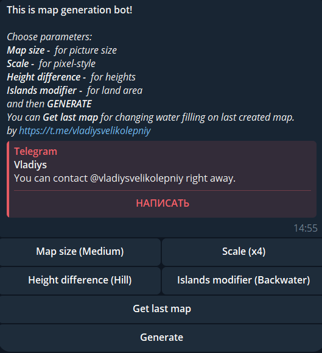
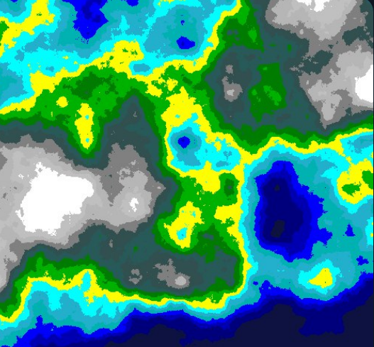
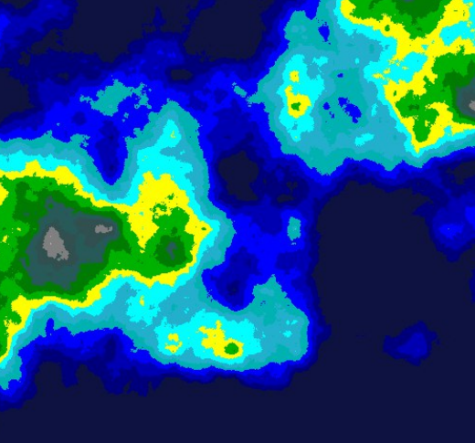

# TerraNotaBot_V1.0.1

This is TerraNotaBot.
You can create geographic map image depends on:
Map size -  for picture size
Scale -  for pixel-style
Height difference -  for heights
Islands modifier -  for land area

Select parameters and generate map!
 

Watch result and change water level on your map!
From
 
To

